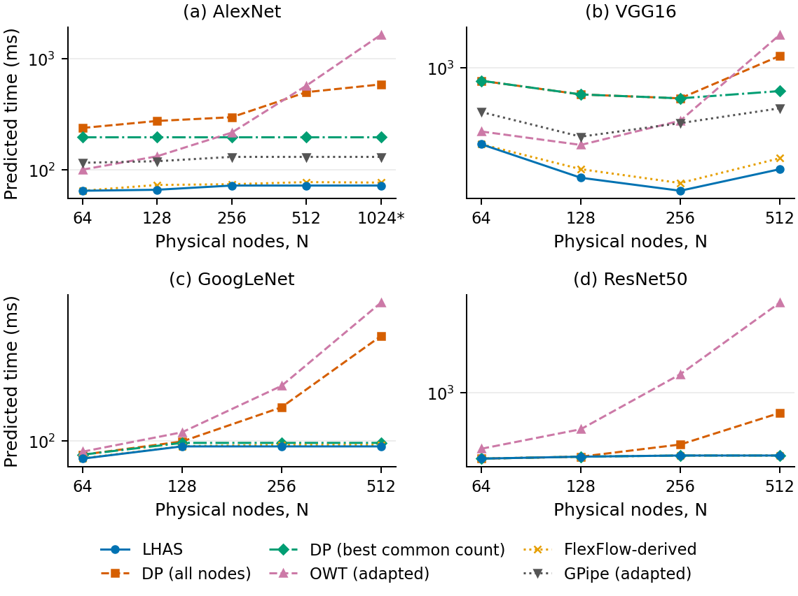

# LHAS

**Layer-wise Hybrid Parallelism for Distributed DNN Training on Optical Interconnects**

LHAS selects data parallelism (DP), output-feature model parallelism (MP), and
node counts for individual DNN layers. This repository accompanies the TOMPECS
submission and includes the implementation, experiment settings, stored results,
and scripts needed to reproduce the evaluation for AlexNet, VGG16, GoogLeNet,
and ResNet-50.

Start with the small example below to check your installation. You can then
[recreate the paper figures and tables](#recreate-the-paper-figures-and-tables)
from the included results or [run additional experiments](#run-additional-experiments).
**A GPU is needed only to collect new computation profiles.** The analytical
experiments and analysis of the included Tesla T4 measurements run on a CPU.

## Quick start (CPU only)

Use Python 3.11 on Linux. Clone the repository and install the pinned dependencies:

```bash
git clone https://github.com/TravisDai/LHAS.git
cd LHAS
python3.11 -m venv .venv
source .venv/bin/activate
python -m pip install -r environment/requirements-cpu.txt
```

Run all remaining commands from the repository root. This example evaluates
AlexNet on a modeled 64-node ring and compares LHAS with DP, best common-count
DP, and OWT:

```bash
python experiments/run_chain.py --workload alexnet --N 64 \
  --baselines dp,dpbest,owt --out reproduced --tag quickstart
python scripts/check_reproduction.py reproduced/quickstart/alexnet_N64.json \
  --require-baselines dp_N,dp_best,owt
```

The final line should be **`RESULT: agrees`**. The check compares the selected
configurations, predicted times, baseline statuses, and workload/specification and source hashes with
the stored result. Your new JSON is saved in `reproduced/quickstart/`; the
reference results stay in `results/raw/`. The small example usually takes tens
of seconds, with extra time possible for first-use compilation.

To check the implementation and report any skipped tests:

```bash
python -m pytest -q -rs tests
```

The CPU environment skips the PyTorch/torchvision-dependent checks. See the
[full environment instructions](docs/REPRODUCING.md#5-full-environment-and-optional-checks)
if you also want to run those checks or the notebook's CPU smoke test.

## Recreate the paper figures and tables

These commands use the included results and measurements:

```bash
python scripts/make_presentation_figures.py --output reproduced/figures
python scripts/analyse_profile.py
python scripts/make_tables.py
```

| Paper content | Where to find the output |
|---|---|
| Figures 6-10 and 12: comparisons, ablations, sensitivities, and layer configurations | `reproduced/figures/`, in PDF, PNG, and SVG formats |
| Figure 11: T4 computation-model validation | [`figures/fig_t4_compute_validation.pdf`](figures/fig_t4_compute_validation.pdf) |
| Exact evaluation tables | [`results/processed/tables.md`](results/processed/tables.md) |
| T4 error statistics and ranking analysis | [`results/processed/t4_validation.md`](results/processed/t4_validation.md) and its JSON source |

The analysis and table commands update their generated files in `figures/` and
`results/processed/`. The underlying measurements and raw experiment results
are unchanged. The [paper figure and table map](docs/presentation_figures.md#paper-figure-and-table-map)
links each item to its inputs and reproduction command.

You can also check that the plot inputs match the recorded results:

```bash
python -m pytest -q tests/test_presentation_figures.py
```

This checks every field in the plot-input snapshot and all 146 recorded raw-file
hashes. PDF export timestamps can differ even when the data and rendered plots
are identical.



*Main comparison under the analytical model. Exact values and result statuses
are in the [evaluation tables](results/processed/tables.md).*

## Run additional experiments

Use `experiments/run_chain.py` for AlexNet and VGG16, and
`experiments/run_graph.py` for GoogLeNet and ResNet-50. For example:

```bash
python experiments/run_graph.py --workload googlenet --N 64 \
  --baselines dp,dpbest,owt --out reproduced --tag googlenet64
```

To repeat the AlexNet comparison using the included measured T4 computation:

```bash
python experiments/run_chain.py --workload alexnet --N 64 \
  --profile configs/profiles/profiled_Tesla_T4_B1024.json --red-rate 218.6e9 \
  --baselines dp,dpbest,owt --out reproduced --tag profiled
python scripts/check_reproduction.py reproduced/profiled/alexnet_N64.json \
  --ref-tag final_profiled_T4 --require-baselines dp_N,dp_best,owt
```

The [experiment guide](docs/experiments.md) lists every study, its settings,
and its stored outputs. The [full reproduction instructions](docs/REPRODUCING.md#6-full-experiment-queues)
provide command queues for all workloads, baselines, ablations, sensitivities,
and supplementary runs. Use a separate checkout for those queues: they write
to the paper's `final*` result directories. Full queues can take hours; use the
small examples above to check your environment first.

For new GPU measurements, open
[`colab/LHAS_compute_profiling.ipynb`](colab/LHAS_compute_profiling.ipynb)
in Google Colab and follow the [profiling instructions](docs/REPRODUCING.md#7-measured-computation-and-future-profiling).
The included T4 measurements were collected with notebook v2. The current v3
notebook has been checked on CPU but has not been run on a GPU.

## Understanding the results

The main study predicts iteration times under a declared optical communication,
computation, and memory model. Its nominal settings use a global batch of 1,024
and ring sizes of 64-512 nodes; AlexNet at 1,024 nodes is supplementary.
[The configuration file](configs/nominal_experiment.json) gives the defaults.

The T4 study combines measured local computation on one GPU with modeled
communication. These comparisons do not measure distributed execution or
validate optical hardware timing. The branch search minimizes an additive cost
and then checks memory; its guarantee is limited to that objective and the
conditions stated in the [model specification](docs/decision_table.md).

For more detail:

- [Reviewer guide](docs/REVIEWER_GUIDE.md): what each part of the evidence supports.
- [Reproduction guide](docs/REPRODUCING.md): environments, commands, result statuses, and troubleshooting.
- [Verification scope](docs/verification.md): checks performed on selected LHAS schedules.
- [Provenance](PROVENANCE.md): source digests, result history, and measurement records.
- [Documentation index](docs/README.md): model, memory, baseline, and implementation details.
- [AI-use statement](docs/AI_USE.md): development assistance and authors' responsibility.

## Citation, license, and questions

Follow [the citation guidance](CITATION.md) and record the commit you use with
`git rev-parse HEAD`. The artifact is available under the [MIT License](LICENSE).
The manuscript is maintained separately until publication.

If a command fails or a result differs, open a
[GitHub issue](https://github.com/TravisDai/LHAS/issues) with your commit,
environment, command, and observed output. See [CONTRIBUTING.md](CONTRIBUTING.md)
for contribution guidelines.
