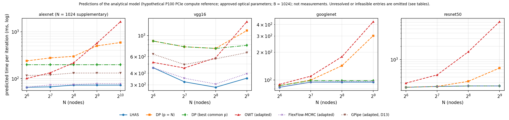

# LHAS

**Layer-wise hybrid parallelism for DNN training on wavelength-routed optical interconnects**

LHAS is a research reproducibility artifact accompanying a manuscript submitted to
*ACM Transactions on Modeling and Performance Evaluation of Computing Systems*
(TOMPECS). It models computation, optical communication, and memory requirements,
then searches for per-layer data-parallel (DP) and output-feature model-parallel
(MP) configurations. The implementation covers AlexNet, VGG16, GoogLeNet, and
ResNet-50, with adapted baselines and an independent communication-schedule verifier.

**Publication status:** the manuscript is not yet published and is not included
here. This repository contains code, experiment configurations, stored results,
and reproduction tools. A software license and archival release are pending;
see [project status](docs/STATUS.md) and [citation guidance](CITATION.md).

## Start here

| Your goal | Where to start |
|---|---|
| Read the results without running code | [Result tables](results/processed/tables.md), [figures](figures/), and [run coverage](results/processed/status.md) |
| Check one result on a CPU | [Quick start](#quick-start-cpu-only) below |
| Regenerate reports or run experiments | [Reproduction guide](docs/REPRODUCING.md) |
| Understand the model and baselines | [Experimental specification](docs/decision_table.md) and [memory accounting](docs/memory_ledger.md) |
| Assess the verification and measurements | [Verification scope](docs/verification.md) and [T4 validation report](results/processed/t4_validation.md) |
| Trace a result to its inputs and code | [Provenance](PROVENANCE.md) |

## What the artifact evaluates

The main study reports **predicted training-iteration times** under a declared
optical communication model and a hypothetical P100 PCIe compute reference.
These are model outputs, not measured distributed-training times.

The artifact also includes **measured local kernel times from one Tesla T4**.
They support compute-model validation and a separate planning sensitivity study
at modeled system sizes of 64 and 256 nodes. They do not measure optical
communication or distributed execution. The stored measurements were collected
with notebook v2; the supplied v3 notebook has been checked on CPU but has not
been run on a GPU.



*Main model-based comparison. Exact values, feasibility statuses, resource limits,
and supplementary-run labels are provided in the [result tables](results/processed/tables.md).
Missing or unresolved entries are not measured zero-cost results.*

The implementation includes:

- Deterministic routing and wavelength allocation, with adapted OSM, WRHT,
  mixed-radix OpTree, and unequal-group collective candidates.
- Memory-aware chain search and typed fork/join interfaces for branch networks.
- Pure DP, best common-count DP, adapted OWT, a FlexFlow-derived Metropolis
  search, and an optical-adapted GPipe comparison for the chain workloads.
- An independent verifier for selected LHAS communication schedules, with
  per-operation coverage records and explicit resource limits.

Baseline definitions, candidate domains, and exactness qualifications are in the
[specification](docs/decision_table.md). In particular, the branch objective is an
additive modeled cost, not a simulated concurrent execution makespan.

## Quick start (CPU only)

Use **Python 3.11** and a Linux environment. A GPU is not required to run the
simulator, inspect the stored T4 data, or regenerate the reports. The reference
environment used Python 3.11.15; all commands below run from the repository root.

```bash
git clone https://github.com/TravisDai/LHAS.git
cd LHAS
python3.11 -m venv .venv
source .venv/bin/activate
python -m pip install -r environment/requirements-cpu.txt
```

Run one AlexNet configuration and compare it with the stored result. The new
output goes to a temporary directory, leaving the reference results intact.

```bash
LHAS_CHECK_DIR=$(mktemp -d)
python experiments/run_chain.py --workload alexnet --N 64 \
  --baselines dp,dpbest,owt --out "$LHAS_CHECK_DIR" --tag check
python scripts/check_reproduction.py "$LHAS_CHECK_DIR/check/alexnet_N64.json"
```

The comparison should finish with **`RESULT: agrees`**. It checks the selected
LHAS configuration and cost, the requested baseline statuses and costs, and the
source, workload, and nominal-specification hashes. It does not rerun the
Metropolis or GPipe comparisons. A previous two-core run took about 19 seconds;
first-use compilation and machine speed affect runtime.

Run the tests with skip reasons visible:

```bash
python -m pytest -q -rs tests
```

The CPU environment omits PyTorch and torchvision. Their dependent checks are
skipped; the [reproduction guide](docs/REPRODUCING.md#5-full-environment-and-optional-checks)
describes the full environment. CI uses the same CPU-only scope.

## Experimental scope

| Setting | Nominal study |
|---|---|
| Workloads | Pinned manifests for AlexNet, VGG16, GoogLeNet without auxiliary heads, and ResNet-50 |
| Global batch size | 1,024; a separate sensitivity study uses 256 at 64 nodes |
| Physical ring size | 64, 128, 256, and 512 nodes; AlexNet at 1,024 nodes is supplementary |
| Compute reference | Analytical FLOPs and utilization for a hypothetical P100 PCIe reference; measured T4 inputs are a separate study |
| Memory budget | 12 GiB per node, including a 1 GiB runtime reserve and one momentum buffer per trainable parameter |
| BatchNorm | Synchronized statistics under DP; channel-local statistics under output-feature MP |
| Raw-input gradient | Omitted for the nontrainable graph input; retained in a sensitivity run |
| Overlap | No overlap in the nominal run; parameterized sensitivity runs |

The machine-readable defaults are in
[`configs/nominal_experiment.json`](configs/nominal_experiment.json).
[Experiment coverage](docs/experiments.md) maps each study to its queue and raw outputs.

## Repository guide

| Path | Contents |
|---|---|
| [`src/lhas/`](src/lhas/) | Transport, collective, model, planner, and baseline implementations |
| [`src/lhas_verify/`](src/lhas_verify/) | Independent schedule verifier |
| [`configs/`](configs/) | Model parameters, workload manifests and hashes, and ingested profiles |
| [`experiments/`](experiments/) | Chain, branch, and GPipe experiment runners |
| [`scripts/`](scripts/) | Queue generation, reporting, profile ingestion, and reproduction checks |
| [`tests/`](tests/) | Mathematical, implementation, verifier, and regression checks |
| [`colab/`](colab/) | Local-computation profiling notebook, generator, and CPU smoke test |
| [`results/`](results/) | Raw results, processed reports, profiles, queues, logs, and labeled archives |
| [`figures/`](figures/) | Generated result figures in PDF and PNG formats |
| [`docs/`](docs/README.md) | Reader guide, specification, verification, and development records |

## Reproducibility and limitations

The public repository starts from a clean checkpoint. Development commit hashes
in stored outputs refer to the private development history; [PROVENANCE.md](PROVENANCE.md)
maps them to source digests. Archived results are retained for traceability and
are not substitutes for the final experiment set.

Schedule verification establishes conformance to the implemented model within
its recorded coverage. It does not establish optical hardware accuracy. The
T4 study reports substantial per-kernel compute-model error, and its profiled
planning comparisons cover only LHAS, DP, best common-count DP, and OWT.
See [verification scope](docs/verification.md),
[T4 validation](results/processed/t4_validation.md), and
[known limitations](docs/STATUS.md) before interpreting comparisons.

## Citation, questions, and contributions

Use the [citation guidance](CITATION.md) to identify the exact checkpoint you use.
Please report reproduction questions and defects through
[GitHub Issues](https://github.com/TravisDai/LHAS/issues), including your command,
environment, and repository commit. [CONTRIBUTING.md](CONTRIBUTING.md) explains how
to propose changes while preserving the recorded experiments.

## License

A software license has not yet been selected. Public availability does not
itself grant an open-source license; reuse permissions remain to be specified
by the copyright holders. Third-party components retain their respective licenses.
